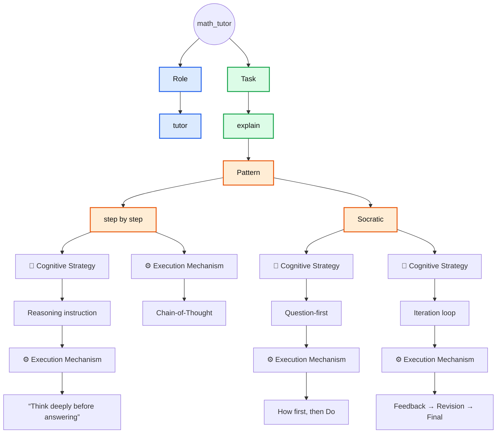

# Default Agents

**Matched** columns correspond to **items** from [The Iceberg Of Prompting](../../the_iceberg_of_prompting.md) framework.

## cs_instructor

TODO:

## math_tutor

| Role  | Task    | Pattern        | 🧠 Cognitive Strategy | ⚙️ Execution Mechanism            |
|-------|---------|----------------|-----------------------|-----------------------------------|
| tutor | explain | step by step   | Reasoning instruction | “Think deeply before answering”   |
| tutor | explain | step by step   | —                     | Chain-of-Thought                  |
| tutor | explain | Socratic       | Question-first        | How first, then Do                |
| tutor | explain | Socratic       | Iteration loop        | Feedback → Revision → Final       |

